# 晶核裝備強化計算器

> Crystal of Atlan Enhancement Calculator

為「晶核（Crystal of Atlan）」遊戲設計的裝備強化機率計算工具。提供無狀態的 REST API 與互動式網頁操作畫面。

---

## 目錄

- [遊戲機制](#遊戲機制)
- [催化劑使用技巧](#催化劑使用技巧)
- [架構](#架構)
- [API 端點](#api-端點)
- [計算引擎](#計算引擎)
- [催化劑建議系統](#催化劑建議系統)
- [策略提示](#策略提示)
- [強化狀態追蹤](#強化狀態追蹤)
- [JSON 匯入／匯出](#json-匯入匯出)
- [網頁畫面](#網頁畫面)
- [測試](#測試)
- [技術棧](#技術棧)

---

## 遊戲機制

### 強化規則

| 等級範圍 | 基礎成功率 | 失敗懲罰 |
| --------- | ------------------------ | ------- |
| +0 | 100% | 無（必定成功） |
| +1 ～ +10 | 線性遞減（+1 = 92%，+10 = 20%） | 無 |
| +11 ～ +14 | 20% | 降 1 級 |

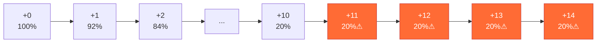

公式：`base_rate(level) = 1.0 − 0.08 × level`（1 ≤ level ≤ 10），+11～+14 固定 20%。

可透過 API 的 `base_success_rates` 參數覆蓋預設值。

### 保底機制

每等級獨立追蹤失敗次數（0 ～ 6）。**第 7 次必定成功**，且無需使用催化劑。

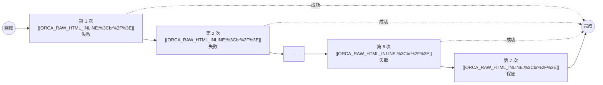

### 催化劑

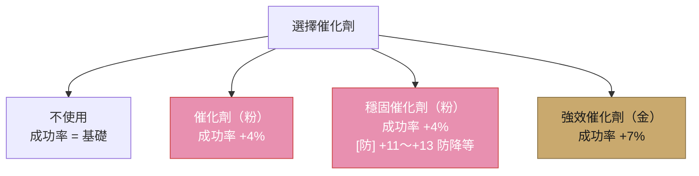

> **重要**：穩固催化劑僅在 +11～+13 具防降等效果，其餘等級（+0～+10, +14）等同一般催化劑。
>
> **製作**：穩固催化劑可由兩個催化劑（粉）合成。

---

## 催化劑使用技巧

| 等級 | 推薦催化劑 | 理由 |
| --------- | ------------ | -------------------------- |
| +0 ～ +11 | 不使用 | 失敗無懲罰或效益不高，無需浪費催化劑 |
| +12 ～ +13 | 穩固催化劑（粉） | 可防止降等，優先使用 |
| +14 | 強效催化劑（金） | 穩固催化劑不防 +14，強效催化劑成功率最高 |

> 雖然穩固催化劑在 +11 有防降等效果，但因 +11 降等僅回退 1 級，損失有限，
> 且穩固催化劑需要兩個催化劑合成，保留至 +12／+13 使用更划算。

> **保底機制**：第 7 次必定成功，無需使用催化劑。

---

## 架構

### 系統架構

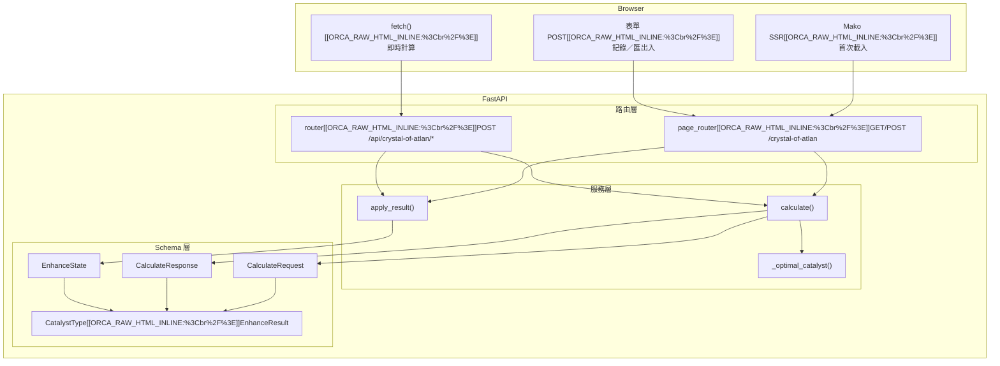

### 檔案結構

```
app/
├── main.py                                # FastAPI 應用入口
├── core/
│   └── templates.py                       # Mako TemplateLookup
├── schemas/crystal_of_atlan/
│   └── enhance.py                         # 請求／回應 Pydantic 模型
├── services/crystal_of_atlan/
│   └── enhance.py                         # 計算引擎
├── routers/api/crystal_of_atlan/
│   └── enhance.py                         # REST API + 頁面路由
templates/crystal_of_atlan/
└── enhance.html                           # 網頁模板
```

核心設計原則：**無狀態**，不依賴資料庫。玩家透過 JSON 檔案自行管理強化記錄。

---

## API 端點

所有 API 路徑前綴為 `/api/crystal-of-atlan`。完整 Swagger 文件可於伺服器啟動後存取 `/docs`。

### `POST /api/crystal-of-atlan/calculate`

計算強化策略。

**Request**（`application/json`）：

| 欄位 | 型別 | 必要 | 說明 |
| -------------------- | ------------------ | --- | ---------------------------------------------- |
| `current_level` | `int` | ✅ | 目前強化等級（0 ～ 14） |
| `progress` | `int` | ✅ | 目前等級已失敗次數（0 ～ 6） |
| `catalyst` | `string` | ❌ | 催化劑類型：`"none"`、`"basic"`、`"stable"`、`"potent"` |
| `base_success_rates` | `dict[int, float]` | ❌ | 覆蓋預設基礎成功率 |

```json
{
  "current_level": 12,
  "progress": 3,
  "catalyst": "stable"
}
```

**Response**（`200 OK`）：

| 欄位 | 型別 | 說明 |
| ------------------------- | -------------- | ------------------------------------- |
| `current_level` | `int` | 目前等級 |
| `progress` | `int` | 目前失敗次數 |
| `base_success_rate` | `float` | 基礎成功率 |
| `catalyst_boost` | `float` | 催化劑加成 |
| `effective_success_rate` | `float` | 有效成功率（基礎 + 催化劑，上限 1.0） |
| `use_catalyst` | `bool` | 是否選擇了催化劑 |
| `catalyst_recommendation` | `string` | 催化劑建議（含 HTML 標籤，見[催化劑建議系統](#催化劑建議系統)） |
| `expected_attempts` | `float` | 期望嘗試次數 |
| `expected_catalysts` | `float` | 期望催化劑消耗量 |
| `notes` | `list[string]` | 策略提示（見[策略提示](#策略提示)） |

```json
{
  "current_level": 12,
  "progress": 3,
  "base_success_rate": 0.2,
  "catalyst_boost": 0.04,
  "effective_success_rate": 0.24,
  "use_catalyst": true,
  "catalyst_recommendation": "",
  "expected_attempts": 3.42,
  "expected_catalysts": 2.42,
  "notes": [
    "⚠ 失敗將導致降等",
    "穩固催化劑可防止降等"
  ]
}
```

### 請求／回應流程

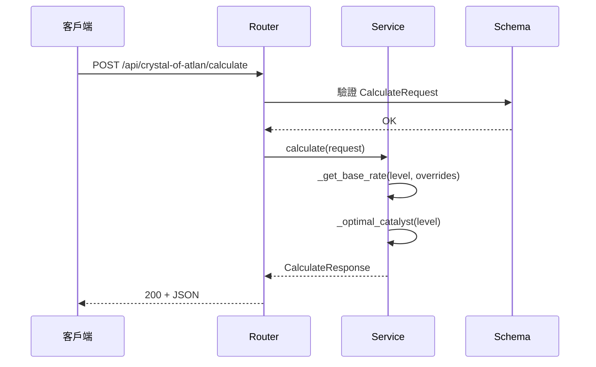

### `POST /api/crystal-of-atlan/record`

記錄一次強化結果並更新狀態。

```json
{
  "state": { "current_level": 12, "progress": { "12": 3 } },
  "result": "success",
  "catalyst": "stable"
}
```

**Response**（`200 OK`）：更新後的 `EnhanceState`。

### `POST /api/crystal-of-atlan/export`

匯出強化狀態為 JSON 下載。**Request**：`EnhanceState`。**Response**：`Content-Disposition: attachment`。

### `POST /api/crystal-of-atlan/import`

匯入強化狀態 JSON 檔案（`multipart/form-data`，欄位 `file`）。上限 1 MB。

---

## 計算引擎

所有計算邏輯位於 `app/services/crystal_of_atlan/enhance.py`。

### 三條程式路徑

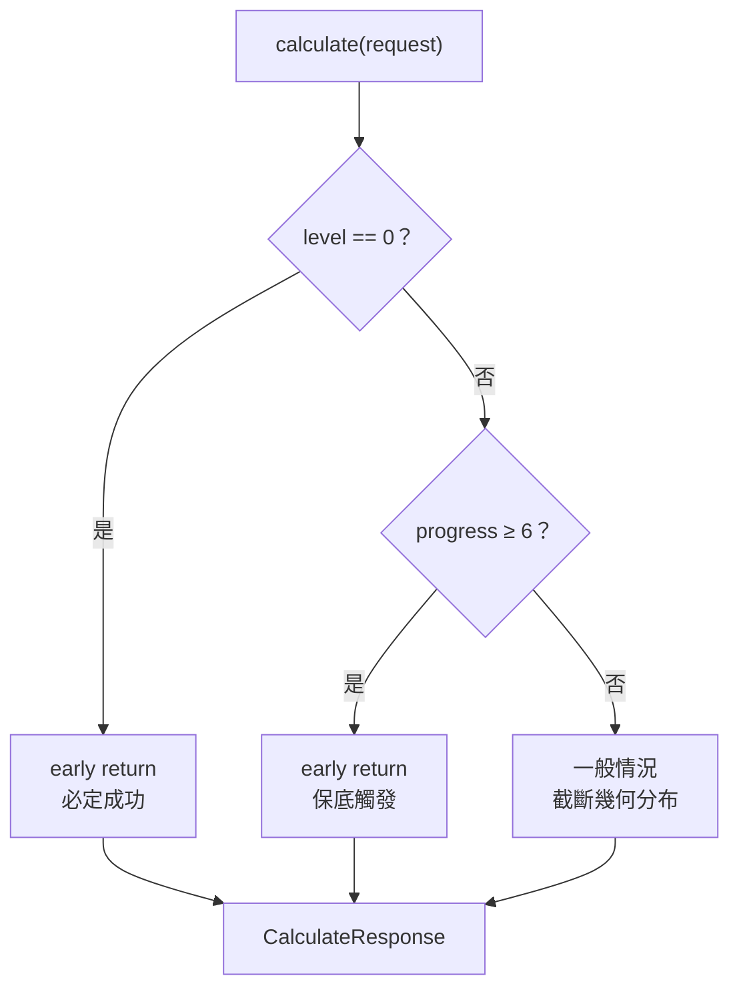

### 期望嘗試次數

因保底機制將嘗試次數截斷為最多 `remaining + 1` 次（`remaining = 6 − progress`），採用截斷幾何分布：

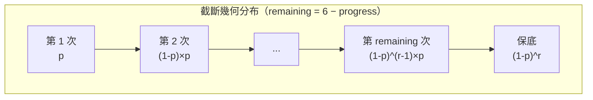

### 狀態轉換（`apply_result`）

```mermaid
stateDiagram-v2
    [*] --> 當前等級

    state 強化成功 {
        當前等級 --> 等級+1 : progress 歸零
    }

    state 強化失敗_低等 {
        當前等級 --> 當前等級 : progress +1
    }

    state 強化失敗_高等 {
        當前等級 --> 等級−1 : progress +1
    }

    note right of 強化失敗_高等
        +11～+14 觸發
        +11／+12／+13 + 穩固催化劑除外
    end note
```

| 結果 | 等級變化 | 進度變化 | 降等條件 |
| ----------- | ---------------------------- | --------------- | ------------------ |
| 成功 | `level += 1`（上限 14） | 歸零 | — |
| 失敗（+1～+10） | 不變 | `progress += 1` | — |
| 失敗（+11～+14） | `progress += 1`，`level -= 1` | 不變 | +11／+12／+13 搭配穩固催化劑可避免 |

---

## 催化劑建議系統

> 各等級的推薦策略請參考上方 [催化劑使用技巧](#催化劑使用技巧)，此處說明程式實作邏輯。

### 最佳催化劑（`_optimal_catalyst`）

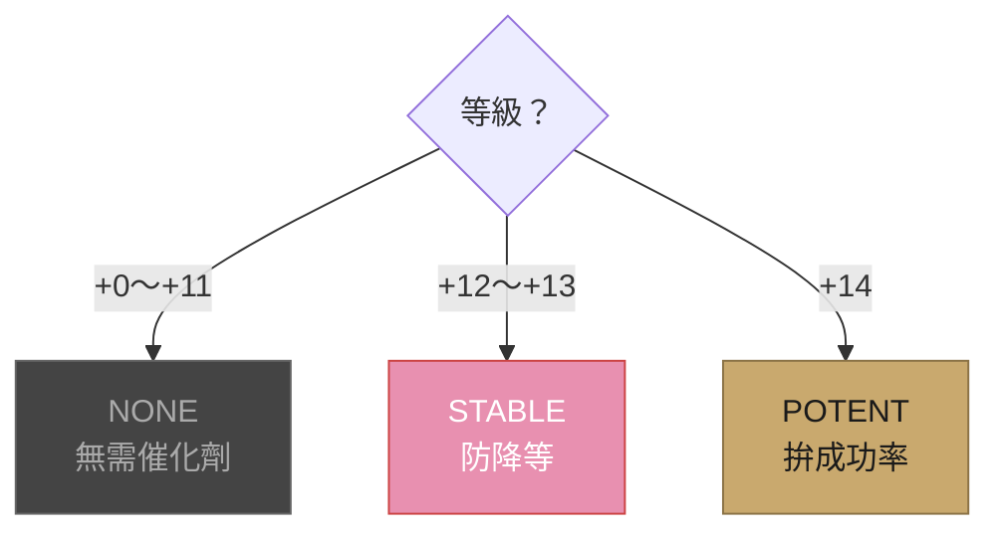

| 等級 | 回傳值 | 理由 |
| --------- | ---------------------- | -------------------------- |
| +0 ～ +11 | `CatalystType.NONE` | 失敗無懲罰或效益不高，無需浪費催化劑 |
| +12 ～ +13 | `CatalystType.STABLE` | 穩固催化劑可防止降等 |
| +14 | `CatalystType.POTENT` | 穩固催化劑不防 +14，強效催化劑成功率最高 |

### 建議文字（`catalyst_recommendation`）

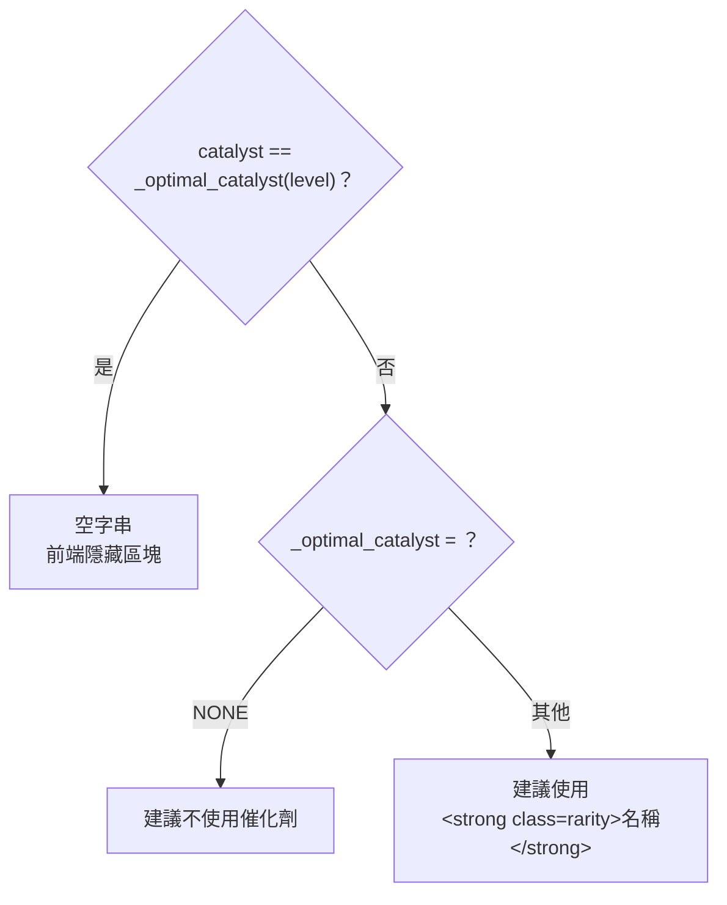

### 範例矩陣

| 等級 | 選擇 | 最佳 | 建議 |
| --- | ------ | ------ | ----------------- |
| +5 | NONE | NONE | —（無建議） |
| +5 | POTENT | NONE | 建議不使用催化劑 |
| +11 | STABLE | NONE | 建議不使用催化劑 |
| +12 | BASIC | STABLE | 建議使用 **穩固催化劑（粉）** |
| +13 | BASIC | STABLE | 建議使用 **穩固催化劑（粉）** |
| +14 | BASIC | POTENT | 建議使用 **強效催化劑（金）** |

---

## 策略提示

`calculate()` 的回應中 `notes` 欄位依等級提供策略提示，共四類：

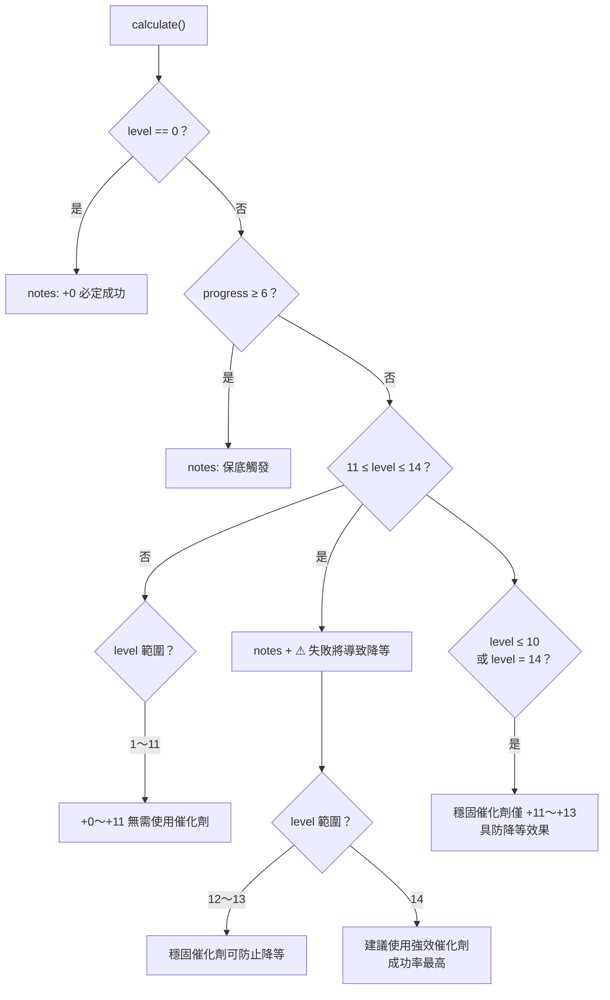

---

## 強化狀態追蹤

### `EnhanceState`

```json
{
  "current_level": 12,
  "progress": {
    "5": 3,
    "11": 2,
    "12": 3
  }
}
```

### 狀態機

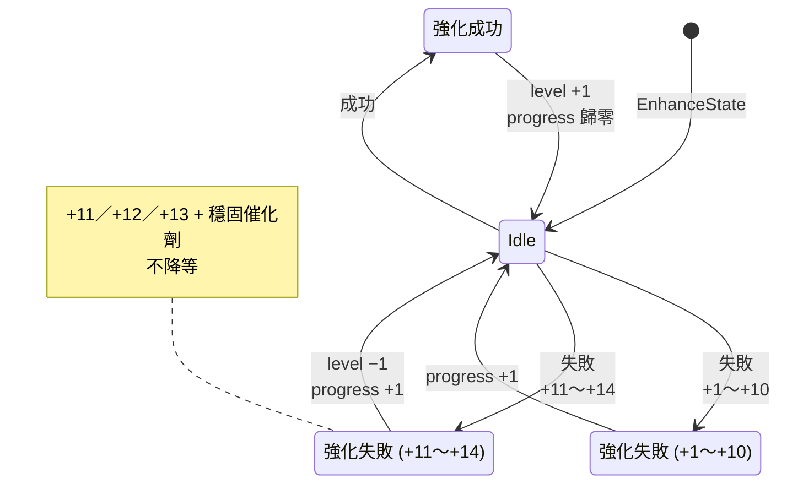

---

## JSON 匯入／匯出

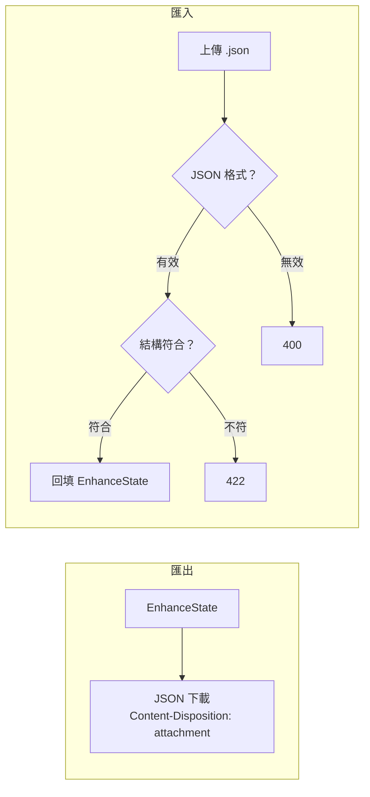

- `current_level`：0 ～ 14 整數
- `progress`：每個值 0 ～ 6 整數
- 上限 1 MB

---

## 網頁畫面

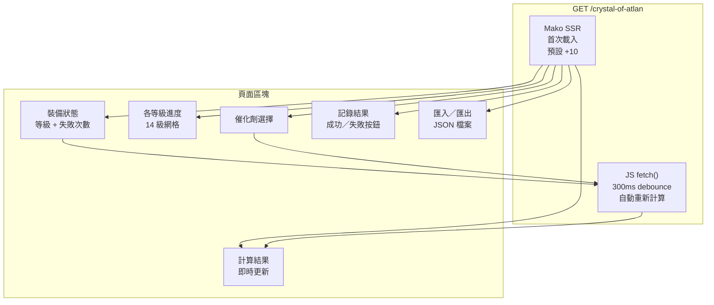

### 結果面板欄位

- 基礎成功率
- 催化劑加成
- 有效成功率
- 是否使用催化劑
- 期望嘗試次數
- 期望催化劑消耗
- 催化劑建議（僅在當前選擇非最佳時顯示）
- 策略提示（notes）

---

## 測試

```bash
uv run pytest -v
# 79 passed
```

### 測試分層

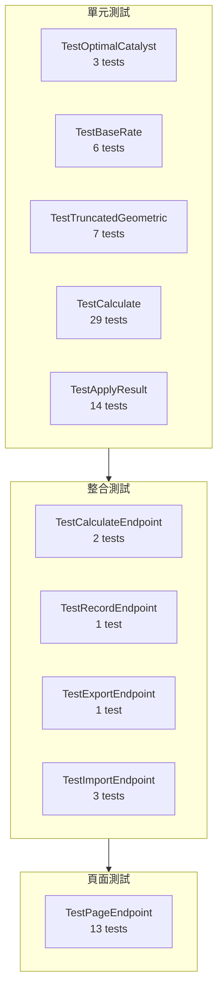

| 類別 | 數量 | 涵蓋範圍 |
| ----------------------- | --- | ------------------------ |
| `TestOptimalCatalyst` | 3 | 各等級最佳催化劑選擇 |
| `TestBaseRate` | 6 | 基礎成功率、覆蓋、範圍校驗 |
| `TestTruncatedGeometric` | 7 | 截斷幾何分布期望值計算 |
| `TestCalculate` | 29 | 三大路徑、催化劑比較、建議系統、策略提示 |
| `TestApplyResult` | 14 | 狀態轉換、降等邏輯、自動初始化 |
| `TestCalculateEndpoint` | 2 | API 合法請求、參數校驗 |
| `TestRecordEndpoint` | 1 | 記錄強化結果 |
| `TestExportEndpoint` | 1 | 匯出下載 |
| `TestImportEndpoint` | 3 | 匯入、無效 JSON、無效結構 |
| `TestPageEndpoint` | 13 | 頁面 HTML、計算、記錄、匯出、匯入、解析錯誤 |

---

## 技術棧

| 技術                                                     | 用途               |
| ------------------------------------------------------ | ---------------- |
| [FastAPI](https://fastapi.tiangolo.com/)               | 後端框架             |
| [Mako](https://www.makotemplates.org/)                 | SSR 模板引擎         |
| [Pydantic v2](https://docs.pydantic.dev/)              | 資料驗證             |
| [Granian](https://github.com/emmett-framework/granian) | ASGI 伺服器         |
| [pytest](https://docs.pytest.org/)                     | 測試框架             |
| [uv](https://docs.astral.sh/uv/)                       | 套件管理             |
| [ruff](https://docs.astral.sh/ruff/)                   | Linter／Formatter |
| [ty](https://github.com/microsoft/pyright)             | 靜態型別檢查           |
